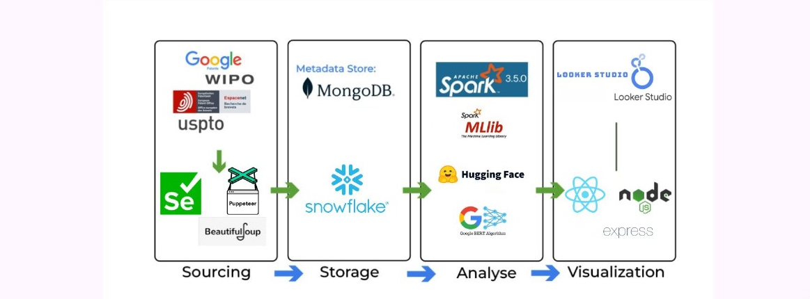

# 🧠 MediAi: Patent Analysis and Visualization Platform

## 🌟 Project Overview

Welcome to **MediAi**, a cutting-edge platform for exploring and analyzing patent data! 🚀 This project combines web scraping, large-scale data processing, NLP, and interactive visualizations into a user-friendly web app. Gain insights into:  
📈 **Trends**  
🌍 **Geographical Distributions**  
🏢 **Key Players**  
💡 **Technological Focus**

Dive deep into the world of patents with MediAi! 🎉

---

## 🏗️ Project Architecture

MediAi's architecture is a four-stage data pipeline:
<div align="center">
  
</div>

### 1️⃣ **Sourcing**  
- **🔍 Data Acquisition:** Scraping patent data from sources like Google Patents, WIPO, Espacenet, and USPTO.  
- **🤖 Tools Used:** Selenium, Puppeteer (dynamic interactions) & Beautiful Soup (HTML/XML parsing).

### 2️⃣ **Storage**  
- **📦 Metadata:** Stored in MongoDB for flexibility.  
- **💾 Core Data:** Stored in Snowflake for structured warehousing.

### 3️⃣ **Analysis**  
- **🔥 Large-Scale Processing:** Apache Spark 3.5.0 for heavy lifting.  
- **🤖 Machine Learning:** Spark MLlib for training models.  
- **🧠 NLP:** Hugging Face and Google BERT for extracting topics and sentiments.

  
<div style="display: flex; justify-content: center; align-items: center;">
  
  
  
</div>

### 4️⃣ **Visualization**  
- **📊 Dashboards:** Built in Looker Studio.  
- **🌐 Web Application:** Powered by ReactJS & Node.js.


<div style="display: flex; justify-content: center; align-items: center;">
  
  
  *
</div>


---

## 🔄 Data Flow

1. 🕵️ Scrape patent data with Selenium/Puppeteer and parse it using Beautiful Soup.  
2. 📂 Store metadata in MongoDB and structured data in Snowflake.  
3. 🛠️ Use Apache Spark for ML & NLP tasks.  
4. 🌟 Visualize insights in Looker Studio and present them via the web app.

---

## 📈 Analytical Capabilities

### 🔍 Temporal Analysis  
- Track patent activity by year, month, or quarter.

### 🌍 Geographical Analysis  
- Visualize patent applications by country.

### 🏢 Key Player Analysis  
- Identify top inventors, assignees, and frequent collaborators.

### 🏷️ Tag & Keyword Analysis  
- **Word Clouds** for popular tags.  
- Use **TF-IDF** to extract key tags.

### 🧩 Text Similarity  
- Compare patent abstracts for similarities. *(Future updates to improve this feature)*

### 🏢 Data Warehousing  
- Transform data into a schema ready for Snowflake integration.


---

## 🌐 Web Application Features

Built with **React**, **Node**, and **Express**, the web app offers:  
- 🎛️ **Filters:** Customize views by resource, pay, applicants, and assignees.  
- 🗺️ **Maps:** Geographical patent distribution.  
- 📊 **Interactive Charts:** Dynamic visualizations of key metrics.

---

## 🛠️ Technologies Used

- **Web Scraping:** Selenium, Puppeteer, Beautiful Soup.  
- **Data Storage:** MongoDB, Snowflake.  
- **Data Processing:** Apache Spark, Spark MLlib.  
- **NLP:** Hugging Face, Google BERT.  
- **Visualization:** Looker Studio.  
- **Web Application:** ReactJS, Node.js, Express.  
- **Data Analysis:** PySpark, Pandas, Matplotlib, WordCloud.  
- **Database Connector:** Snowflake Connector.

---

## 🚀 Get Started

### 🔧 Prerequisites

1. Install Python and required libraries:  
   ```bash
   pip install pyspark pandas matplotlib nltk wordcloud snowflake-connector-python

2. Install Node.js and npm.
3. Configure your Snowflake account credentials.


[Download the project demonstration video](https://github.com/ZakariaBenlamkadam/HealthAI-Patents-Insight/raw/main/video/mediAi_1.mp4)

[You can see the visualisation and interact with it](https://app.powerbi.com/view?r=eyJrIjoiNzhjYzZkYTYtOWVjOS00YjE4LWJhYzItYjViOWNlNWM3Y2YyIiwidCI6ImMyNzg3OTIyLTExZDktNGNhOC1hYWRmLTVlZjdmZjMxYTEyNyJ9)

